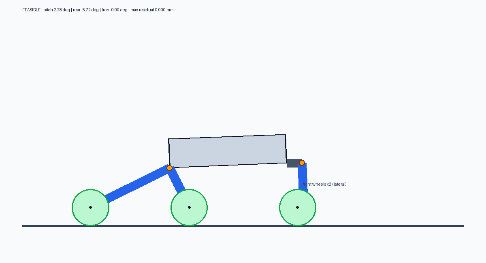

# FORGE

FORGE is an interactive geometry simulator for a six-wheel magnetic wall-climbing robot. It is intended for mechanical design exploration: wheel placement, rigid suspension geometry, terrain conformity, body clearance, interference, and geometric support.



The current implementation is a lightweight quasi-static geometry model. It is not a dynamics, traction, magnetic-force, or control simulation.

## Current robot model

The robot uses three two-wheel modules:

- two identical driven rear modules operating in longitudinal fore-aft planes;
- one fixed transverse front suspension;
- four driven rear wheels and two passive front caster wheels;
- a triangular rigid body.

The two arms in each rear module form one rigid assembly and rotate together around a shared pivot. The front arms are firmly attached to the body and do not rotate as a suspension assembly. Each front wheel can swivel passively in yaw around its caster axis.

The initial dimensions are:

| Parameter | Value |
|---|---:|
| Triangular body rear width | 600 mm |
| Triangular body equal sides | 500 mm |
| Derived body length | 400 mm |
| Body thickness | 100 mm |
| Front rigid-link extension | 50 mm |
| Wheel radius | 63 mm |
| Wheel tread width | 32 mm |
| Rearward rear-module arm | 300 mm at 30° |
| Forward rear-module arm | 150 mm at 60° |
| Front transverse arms | 200 mm at 45° each |
| Front caster offset | −20 mm X, −10 mm Z |

The longitudinal body length is always derived from the isosceles triangle:

```text
body_length = sqrt(equal_side_length² - (rear_width / 2)²)
```

It is not independently adjustable. Rear track width is tied to the triangle's rear width.

## Features

- Exact six-wheel contact solution on a flat plate when one exists
- Quasi-static terrain-following animation
- Longitudinal side view and topographic top view
- True-scale robot and terrain geometry with 100 mm scale bars
- Live geometry sliders with automatic contact re-solving
- Body, wheel, arm, rigid-link, and surface-clearance checks
- Wheel-overlap and wheel-to-body checks
- Contact residual, pitch, clearance, and geometric stability output
- CSV, SVG, and optional PNG result generation
- Dependency-free core geometry and SVG output

## Interactive simulation

Run:

```powershell
python main.py
```

The window opens after the configured flat-plate case is evaluated and the result files are written.

### Controls

| Key | Action |
|---|---|
| Space | Start, pause, or resume |
| R | Reset simulation time, distance, wheel/caster motion, terrain, and pose |
| 1 | Flat plate |
| 2 | Smooth waves |
| 3 | Recycled bump — default |
| 4 | Raised weld seam |
| Escape | Close the window |

Runtime is unlimited by default. Resetting the simulation with `R` preserves live geometry-slider changes.

### Live geometry controls

The scrollable control panel updates the following values in real time:

- triangle rear width and equal-side length;
- body and rigid-link thickness;
- rigid-link extension;
- wheel radius and tread width;
- rear suspension arm lengths, reference angles, and thickness;
- fixed transverse front-arm lengths, angles, and thickness;
- caster X/Z offsets, initial yaw, and alignment rate.

Slider changes are debounced and trigger a new flat-plate contact solve. The status line reports whether the new geometry is feasible, along with body pitch and clearance. `Reset geometry` restores values loaded from `config.yaml`; it is separate from the `R` simulation-state reset.

### Terrain behavior

The default bump is 300 mm long, 800 mm wide, and 35 mm high, so it spans all wheel paths. Mode 3 maintains one bump at a time. A replacement is spawned ahead only after the previous bump has completely left both displayed views.

The top view renders terrain using elevation bands and contour lines. The side view shows the longitudinal centerline section used by the quasi-static terrain follower.

## Batch mode

Generate results without opening the interactive window:

```powershell
python main.py --batch
```

Outputs are written under `results/`:

- `results.csv` — pose, contact, stability, clearance, and collision metrics;
- `robot_on_surface.svg` — vector engineering side view;
- `robot_on_surface.png` — raster preview when Pillow is available.

## Installation

Python 3.10 or newer is recommended.

The geometry solver, Tk interface, CSV output, tests, and SVG rendering use the Python standard library. Tkinter must be included with the Python installation. Pillow is optional and is used only for PNG output:

```powershell
python -m pip install Pillow
```

`config.yaml` currently uses JSON syntax, which is valid YAML. This allows the project to load it with the standard-library `json` module instead of requiring PyYAML.

## Configuration

All internal lengths use metres and angles use degrees. Important configuration groups are:

```text
robot          triangular body, rigid link, wheel dimensions, clearances
rear_module    longitudinal rigid suspension geometry
front_module   fixed transverse arms and caster geometry
contact        residual and interference tolerances
animation      speed, terrain, rendering, and caster animation settings
output         generated-result directory
```

The confirmed geometry and coordinate conventions are also recorded in [`ROBOT_GEOMETRY_FORM.md`](ROBOT_GEOMETRY_FORM.md).

## Tests

Run:

```powershell
python -m unittest -v
```

The regression suite checks:

- all six wheels contact the flat plate;
- the body length equals the isosceles-triangle altitude;
- both rear modules remain explicit;
- the front suspension is transverse and locked;
- the configured caster offsets and wheel width;
- collision-free default geometry;
- single-bump recycling behavior.

## Project structure

```text
main.py                 CLI entry point and output generation
robot_model.py          body, link, arm, caster, and wheel geometry
surface_model.py        analytical flat surface
contact.py              contact solving and feasibility checks
simulation_view.py      interactive Tk simulation and live controls
visualize.py            SVG and optional PNG output
config.yaml             default robot and animation configuration
test_simulation.py      regression tests
ROBOT_GEOMETRY_FORM.md  confirmed physical geometry
results/                generated reports and preview images
```

## Model limitations

The current implementation does not calculate:

- magnetic adhesion force;
- friction, traction, or slip;
- motor torque or drive dynamics;
- spring, damper, or structural compliance;
- inertia, impact response, or force distribution;
- arbitrary 3D meshes or curved hull surfaces;
- path planning or robot control.

Terrain animation is a quasi-static geometric fit. A visually successful crossing is not proof that the physical robot has sufficient adhesion, traction, structural strength, or stability.

## Next steps

- Full 3D contact and collision geometry
- Cylindrical and imported hull surfaces
- Magnetic gap/adhesion model
- Friction and traction limits
- Motor torque and climbing feasibility
- Parameter sweeps and comparative plots
- Compliance and manufacturing-tolerance analysis
