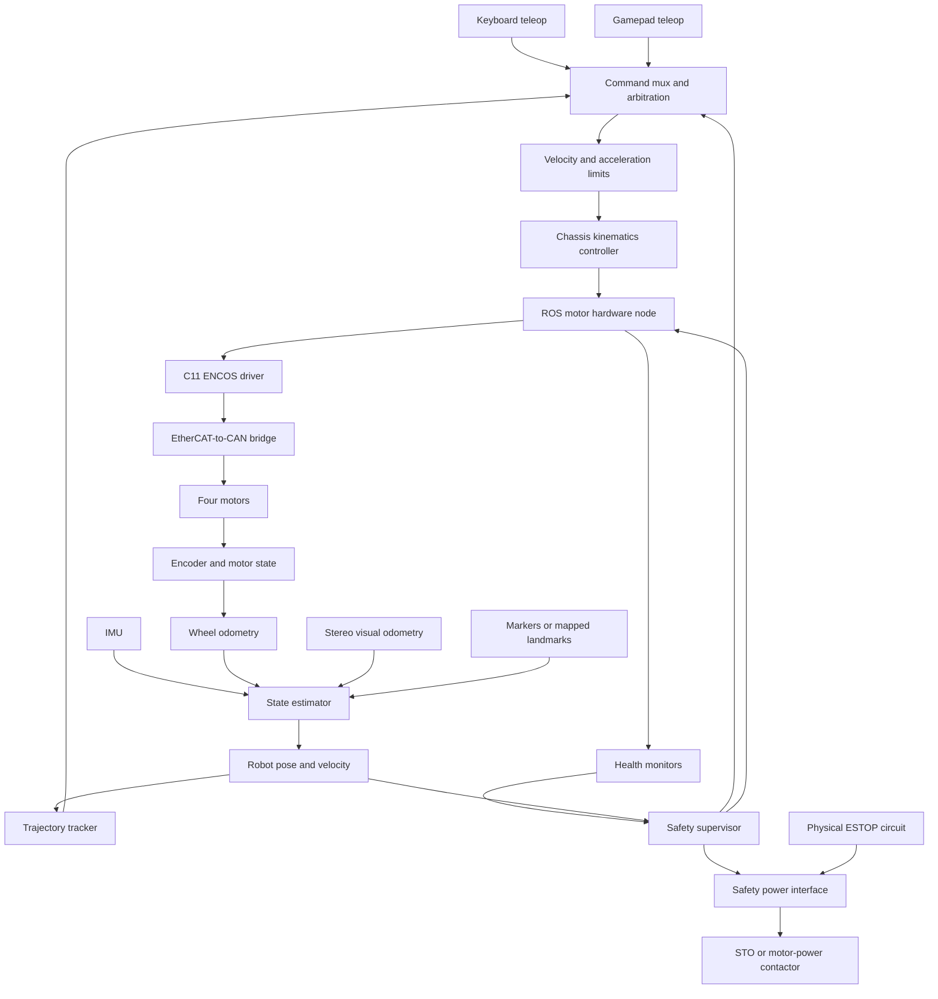

# FORGE robot platform development roadmap

## Purpose

Implementation update: [differential chassis control](DIFFERENTIAL_DRIVE.md) now
integrates differential mixing into `forge_motor_driver`, with stamped chassis
commands and WASD in `forge_keyboard_teleop`, using
the four driven wheels from `forge_sim`. Geometry is provisional and hardware
mapping awaits commissioning. Odometry, arbitration, localization and the safety
supervisor described below remain planned.

This document defines the planned control architecture and staged development of
the four-motor magnetic wall-climbing welding robot. It is the working roadmap for
keyboard testing, gamepad operation, autonomous trajectory tracking, localization,
and safety integration on an Ubuntu 24.04 Intel NUC running ROS 2 Jazzy.

The plan keeps one chassis-command interface across all operating modes. Keyboard,
gamepad, and autonomous control differ only in how they generate a requested chassis
velocity. The chassis controller converts that request into four wheel commands,
and the existing native ENCOS driver handles the EtherCAT/CAN timing.

Robot geometry, linkage properties, mass, inertia, sensor poses, collision geometry,
and joint limits will later be supplied as XML. Prefer ROS URDF with Xacro where
parameters or repeated structures are needed. Hardware limits that affect safe
operation must also live in reviewed configuration rather than relying only on URDF.

The implemented direct-RPM commissioning interface is documented in
[ROS 2 motor control](ROS2_MOTOR_CONTROL_STATUS.md). The chassis interfaces and
keyboard mapping below are planned; dated hardware evidence lives in the
[bench record](ENCOS_TEST_BENCH.md#commissioning-record-2026-09-16).

## System architecture



## Control and ROS 2 nodes

### `forge_motor_driver`

This node wraps the existing Python interface. Python calls the C11 shared library
through `ctypes`; a native worker owns the SOEM EtherCAT loop. ROS and Python must
not perform individual EtherCAT cycles.

Responsibilities:

- Open and exclusively own the dedicated EtherCAT interface.
- Map four configured motors to bridge slots and CAN buses.
- Accept independent Mode 2 velocity and Mode 1 position commands.
- Publish position, velocity, phase current, temperature, errors, and driver state.
- Enforce motor, current, speed, position, and command-age limits.
- Latch communication and motor faults without automatic restart.
- Enter a stopping state when commands expire.
- Report diagnostic data needed to distinguish EtherCAT health from CAN feedback.

Initial bridge mapping:

| Configuration entry | PDO slot | CAN bus |
|---:|---:|---:|
| 1 | 0 | CAN1 |
| 2 | 1 | CAN1 |
| 3 | 2 | CAN1 |
| 4 | 3 | CAN2 |

Motor ID does not select the CAN bus. This mapping must be confirmed on physical
hardware before four-motor operation.

Suggested interfaces:

```text
Subscriptions:
  /drive/wheel_commands
  /safety/protective_stop

Publications:
  /joint_states
  /motors/status
  /diagnostics

Services or lifecycle transitions:
  configure
  arm
  disarm
  clear_fault
```

The final ROS integration should use `ros2_control` when its hardware boundary is
stable. The early Python ROS node remains useful for commissioning and experiments.

### `forge_base_controller`

The base controller accepts `geometry_msgs/TwistStamped`, applies chassis limits,
and converts linear and angular chassis velocity into four wheel RPM targets.
It also converts encoder positions into wheel odometry.

Its model will be completed from the robot XML and supporting configuration:

- Wheel centers and axes in `base_link`.
- Wheel radius and effective rolling radius.
- Driven, caster, fixed, or steerable wheel roles.
- External gearing and per-motor direction.
- Differential, skid-steer, Ackermann, or custom kinematics.
- Chassis speed, yaw-rate, acceleration, and deceleration limits.
- Expected slip and surface-contact assumptions.

### Teleoperation nodes

Keyboard and gamepad nodes publish timestamped chassis velocity commands. They do
not contain motor IDs, gear ratios, or ENCOS packets.

Initial keyboard mapping:

| Input | Action |
|---|---|
| W / S | Forward / reverse request |
| A / D | Left / right turn request |
| Shift | Reduced precision-speed profile |
| Space | Normal controlled stop |
| Escape | Disarm request |

The gamepad uses the same output interface, with stick dead zones, speed scaling,
input filtering, a held dead-man control, and controller-disconnect detection.

### `forge_command_mux`

Only one motion source controls the chassis at a time. Each command carries a source,
timestamp, and expiry. Proposed priority is:

1. Safety stop.
2. Gamepad dead-man stop.
3. Manual gamepad command.
4. Manual keyboard command.
5. Autonomous trajectory command.

Changing control source requires a deliberate transition and zero or near-zero
measured speed. A stale command always results in a stop request.

### Localization and state estimation

Use the standard ROS frame structure:

```text
map
└── odom
    └── base_link
        ├── imu_link
        ├── camera_link
        └── wheel and linkage frames
```

The workpiece frame should also be explicit because the robot may operate on a
vertical or curved surface. The future XML must define sensor transforms relative
to `base_link` and the tool or welding torch transform.

Sensor roles:

- Wheel encoders: high-rate local wheel motion and short-term odometry.
- IMU: angular rate, attitude support, and dynamic measurements.
- Stereo visual odometry: camera motion relative to tracked visual features.
- Known markers or mapped landmarks: correction into the global/workpiece frame.
- Seam sensing, if available: lateral and angular relation to the weld path.

Stereo depth alone is not an absolute position reference. Visual odometry drifts,
and smooth, reflective, repetitive, dark, or arc-lit surfaces may reduce tracking
quality. The estimator must consume camera quality/status and reject degraded data.
Known workpiece markers or surveyed features are the preferred global reference.

### `forge_trajectory_tracker`

The automatic controller consumes a time-parameterized reference containing desired
position, orientation, and process speed. It compares the reference with the fused
state estimate and emits `TwistStamped` corrections through the same command mux
used for teleoperation.

The wheel motors normally remain in ENCOS Mode 2. Chassis position tracking is an
outer feedback loop around motor velocity control. Mode 1 remains available for
bounded wheel-angle tests; Mode 0 is reserved for later work requiring compliance
or explicit torque feedforward.

For welding, path alignment and process speed should normally take precedence over
recovering a lost time schedule. The trajectory should include acceleration, cruise,
and deceleration segments. Completion requires position, heading, and speed to stay
inside tolerances for a configured settling time.

## Stop and ESTOP architecture

The platform needs three distinct stop paths:

| Stop type | Trigger | Intended action |
|---|---|---|
| Normal stop | Operator releases command or trajectory completes | Limited deceleration to zero, then hold or disarm as configured |
| Protective stop | Software fault, stale command, lost localization, or limit violation | Rapid controlled zero-speed request and latched fault |
| Emergency stop | ESTOP button or software ESTOP request | Drop the safety output that removes drive power or activates STO |

### Software ESTOP request

Provide a latched `/safety/estop_request` path with higher priority than all motion
commands. The safety supervisor sends this request to a hardware safety interface,
which de-energizes a safety relay/contactor or asserts a drive-level Safe Torque Off
input. The implementation should use de-energize-to-trip logic so broken wiring,
loss of NUC power, or loss of the safety-output heartbeat moves toward the safe state.

The software path is useful for faults detected by localization, the motor driver,
or a remote operator. It is not the sole emergency-stop channel: normal ROS nodes,
USB devices, Ethernet, Python, and the NUC are not assumed to remain operational
during an emergency.

### Physical ESTOP and motor power isolation

A hardwired, latching ESTOP must directly interrupt the motor torque-producing
energy path through appropriately rated safety hardware. It must work independently
of ROS and the NUC. Resetting the physical button restores only the safety circuit;
it must not re-arm the motors or resume an earlier command.

The final electrical design must decide whether to use:

- A motor-controller STO input, if the exact drive supports a suitable documented one.
- A safety-rated contactor in the motor supply path.
- A coordinated STO/contactor arrangement with a mechanical holding brake.

The bridge's 5 V supply and motor power must be treated separately. Cutting motor
power may leave control electronics alive for diagnosis, if the verified hardware
design supports it. Gravity-loaded or wall-climbing mechanisms may need a brake or
other retention method before torque is removed. Regenerative energy and contactor
ratings must be addressed in the electrical design.

### ESTOP state and reset behavior

Proposed safety states:

```text
DISARMED -> ARMING -> ACTIVE -> STOPPING -> DISARMED
                       |            |
                       +-> FAULT_LATCHED
                       +-> ESTOP_LATCHED
```

`ESTOP_LATCHED` requires all of the following before returning to `DISARMED`:

1. The physical ESTOP circuit is healthy and manually reset.
2. The software ESTOP request is released by an authorized action.
3. Motor and communication faults are acknowledged.
4. Commands are zero and old messages have been discarded.
5. The operator explicitly resets the safety supervisor.

Reset never transitions directly to `ACTIVE`; arming is a separate deliberate step.

## Safety supervisor

Movement is permitted only when all required conditions are true:

- Physical ESTOP loop healthy.
- Safety power interface healthy.
- EtherCAT bridge operational.
- Motor configuration valid and no motor fault active.
- Feedback freshness proven and inside its deadline.
- Motion command fresh and selected by the command mux.
- Chassis and motor limits satisfied.
- Dead-man control held where required.
- Localization quality sufficient for autonomous mode.
- Mechanism and brake state compatible with motion.

The supervisor publishes the active stop cause and keeps it latched. It must never
automatically resume motion after reconnection, process restart, or power recovery.

Required fault-injection tests include Python freeze/exit, ROS node failure, NUC
power loss, Ethernet loss, EtherCAT failure, missing or cached CAN feedback, motor
fault, IMU failure, camera tracking loss, gamepad disconnect, ESTOP activation, and
power restoration. Each test records whether the chassis coasts, brakes, holds, or
moves unexpectedly and how long each transition takes.

## Configuration and robot XML

Use URDF/Xacro XML for physical structure and ROS transforms:

- Link and joint hierarchy.
- Joint axes, origins, and motion limits.
- Visual and collision geometry.
- Mass, center of mass, and inertia tensors.
- Wheel, IMU, camera, and tool poses.
- Transmission descriptions where useful.

Use reviewed YAML for electrical and operational values that may vary by hardware
or test profile:

```yaml
motors:
  - name: front_left
    id: 1
    slot: 0
    can_bus: 1
    direction: 1
    external_ratio: 1.0
    max_rpm: null
    max_current_a: null
    max_acceleration_rpm_s: null
```

The loader must cross-check XML and YAML for missing joints, duplicate motor IDs,
invalid slot/bus combinations, non-finite values, and limits inconsistent with the
motor or mechanism. Configuration errors prevent arming.

## Logging and diagnostics

ROS bags should capture commands, joint states, IMU, visual odometry, localization,
control-source selection, trajectory state, and safety transitions. The native
driver should separately retain concise timing and transport diagnostics.

Record at least:

- Requested chassis and wheel velocities.
- Measured wheel position and velocity.
- Phase current, motor temperature, and errors.
- Command age and verified feedback age.
- EtherCAT state, working counter, loop jitter, and missed cycles.
- IMU and camera tracking status/confidence.
- Fused pose and covariance.
- Active command source and safety state.
- ESTOP input, software request, safety output, and reset events.

## Development phases and acceptance gates

### Phase 0 - development without the NUC

- Maintain four-motor simulation and fake-bridge tests.
- Define ROS messages, configuration schemas, frames, and launch structure.
- Implement keyboard input, command mux, limits, and the safety state machine.
- Add kinematics once robot XML and wheel geometry are available.
- Simulate ESTOP requests and verify latching/reset rules.

Exit gate: deterministic simulated motion, command expiry, source arbitration,
four-motor limits, and safety transitions pass automated tests.

### Phase 1 - NUC and communication commissioning

- Install Ubuntu 24.04, ROS 2 Jazzy, SOEM dependencies, and the ROS workspace.
- Configure the dedicated EtherCAT interface.
- Verify bridge layout, motor identity, telemetry, and CAN feedback freshness.
- Test one secured motor before expanding one at a time to four motors.

Exit gate: every motor passes discovery, signed low-speed motion, bounded position
motion, feedback, normal stop, communication loss, and restart-inhibited tests.

### Phase 2 - keyboard chassis testing

- Add geometry-based four-wheel kinematics.
- Run low-speed supported chassis tests.
- Calibrate motor directions, wheel radii, and encoder distance.
- Measure acceleration, deceleration, stopping distance, and straight-line bias.
- Test normal stop, protective stop, software ESTOP, and physical ESTOP.

Exit gate: repeatable commanded motion and stop behavior within agreed tolerances.

### Phase 3 - gamepad operation

- Add axes, dead zones, speed profiles, dead-man behavior, and disconnect detection.
- Verify command-source handover at zero speed.
- Conduct operator usability and stop-access tests.

Exit gate: manual operation remains bounded through disconnects and mode changes.

### Phase 4 - localization

- Calibrate IMU and stereo camera intrinsics/extrinsics.
- Fuse wheel odometry, IMU, and visual odometry.
- Establish `map`, `odom`, workpiece, chassis, camera, and tool frames.
- Evaluate tracking on real plate surfaces and with welding illumination.
- Add global markers or mapped references as required by measured drift.

Exit gate: pose accuracy, covariance behavior, and tracking-loss detection meet the
defined path and endpoint requirements.

### Phase 5 - trajectory tracking

- Generate acceleration/cruise/deceleration references.
- Track chassis position, heading, and process speed using motor Mode 2.
- Define localization-degradation and path-deviation responses.
- Validate endpoint settling and safe interruption/resume procedures.

Exit gate: representative paths meet geometric, speed, stopping, and safety goals.

### Phase 6 - welding-system integration

- Add seam/tool offsets and process coordination.
- Test camera behavior with arc light, fumes, vibration, and occlusion.
- Coordinate welding enable with motion, localization, and safety state.
- Validate loaded wall-climbing retention and emergency behavior.

Exit gate: system-level review and supervised validation under representative load.

## Information still required

Future XML/configuration should provide:

- Linkage geometry and joint types.
- Four wheel-center positions, axes, radii, and widths.
- Driven/caster/steered wheel roles and expected turning model.
- Motor assignment, direction, external gearing, models, firmware, and brakes.
- Link masses, centers of mass, inertias, payload, and welding forces.
- Joint, travel, speed, acceleration, current, and temperature limits.
- IMU and stereo-camera models and mounting transforms.
- Work surface geometry and expected curvature.
- Target path-speed, heading, lateral, and endpoint tolerances.
- Proposed safety relay, contactor/STO, physical ESTOP, and brake circuitry.

## Immediate next milestone

The NUC-to-bridge-to-three-motor commissioning path is now working on the
secured unloaded bench, including native Python and temporary ROS 2 direct-RPM
control. Next, collect the four-wheel geometry, motor direction/assignment,
external gearing, brake details, and model-specific limits, then implement and
validate a simulated four-motor chassis with steering-aware keyboard
teleoperation, command arbitration, limits, and the safety state machine. The
simulation should consume the same robot XML/YAML and ROS command interfaces
intended for the physical system. In parallel, complete controlled host/link-loss
and loaded stopping tests before chassis motion.
