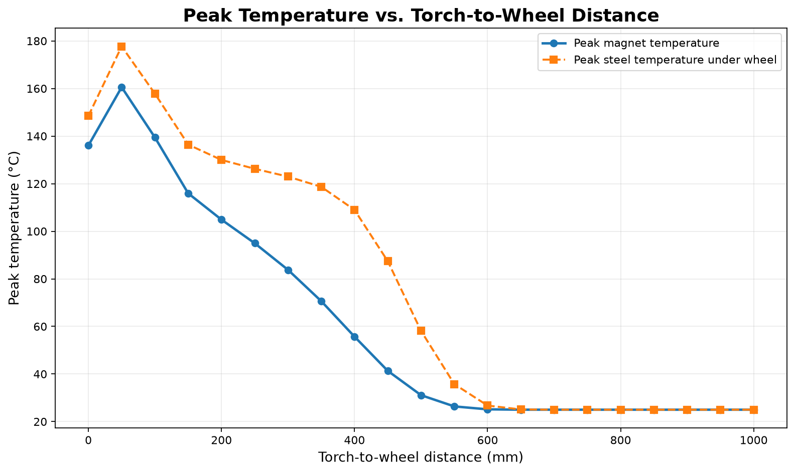
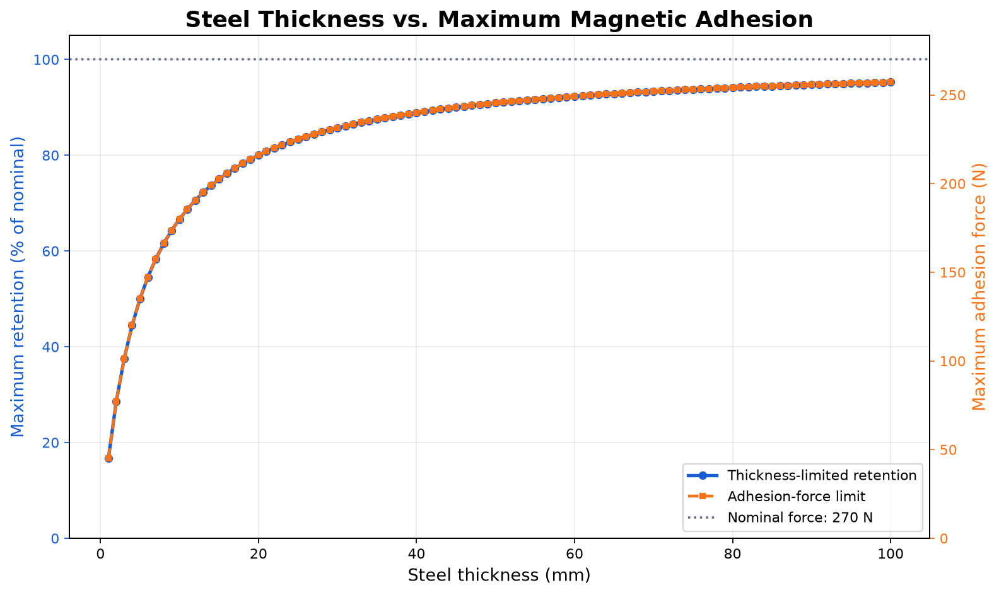

# Magnetic Thermal and Steel-Thickness Simulator

This project estimates the thermal exposure of a magnetic wheel near a moving welding heat source and applies empirical temperature and steel-thickness corrections to nominal magnetic adhesion.



It is an engineering screening model, not a validated welding, magnetostatic, or safety model.

## Model overview

The primary application combines:

- transient three-dimensional heat conduction through a steel plate;
- a moving uniform circular surface heat source;
- convection on the top and bottom plate surfaces;
- energy-conserving thermal contact with a lumped magnet;
- an empirical steel-thickness retention factor;
- a reversible magnet-temperature retention factor.

The robot wheel trails the welding source by a configurable distance. The heat source and wheel travel together along the plate.

## Run the GUI

Install dependencies:

```powershell
python -m pip install -r requirements.txt
```

Start the English interface:

```powershell
python heat_visualizer.py
```

A Chinese-language interface is also included:

```powershell
python heat_vis_cn.py
```

The main controls are:

| Input | Default | GUI range |
|---|---:|---:|
| Robot speed | 8 mm/s | 0–200 mm/s |
| Net heat input to plate | 9 kW | 1–15 kW |
| Torch-to-wheel distance | 300 mm | 0–1000 mm |
| Steel thickness | 20 mm | 10–40 mm |
| Surface cooling coefficient | 10 W/(m²·K) | 0–15 W/(m²·K) |
| Contact conductance | 500 W/(m²·K) | 100–2000 W/(m²·K) |
| Simulation time | 60 s | 5–150 s |

The GUI reports progress, magnet temperature, steel temperature under the wheel, contact activity, magnetic retention, and the nominal lumped contact time constant.

## Thermal model

The plate uses constant properties:

| Property | Value |
|---|---:|
| Density | 7850 kg/m³ |
| Specific heat | 500 J/(kg·K) |
| Conductivity | 45 W/(m·K) |
| Ambient temperature | 25 °C |

The model solves:

```text
ρ cp ∂T/∂t = k ∇²T
```

The explicit finite-difference grid resolves the plate thickness rather than averaging it into one layer. Separate X/Y/Z grid spacings are included in the stability check. The four lateral edges are adiabatic; convection is applied separately to the top and bottom surfaces.

The moving welding input is net power transferred to the plate. It is distributed uniformly over a circular surface footprint with a 70 mm radius. If part of the source footprint leaves the modeled plate, the flux density remains unchanged and only the overlapping portion contributes energy.

## Magnet contact model

The magnet is represented as a lumped thermal mass:

| Property | Value |
|---|---:|
| Magnet mass | 0.25 kg |
| Magnet specific heat | 460 J/(kg·K) |
| Nominal contact area | 0.01 m² |

Thermal contact uses:

```text
Q̇m = h Ag (Ts,contact − Tm)
mm cm dTm/dt = Q̇m
```

Energy added to the magnet is removed from the contacted plate cells. The model currently represents one magnet and does not include magnet-to-air cooling after it leaves the plate.

## Magnetic retention model

The nominal magnetic force is 270 N. Predicted retention is:

```text
Fmag = F0 ηthickness ηtemperature
ηthickness = plate_thickness / (plate_thickness + 5 mm)
ηtemperature = max(0, 1 − 0.0011 max(Tmagnet − 25 °C, 0))
```

The temperature factor approximates reversible flux loss only. The 80 °C GUI warning is an operational screening threshold, not a grade-specific irreversible-demagnetization or Curie-temperature calculation.



## Parameter-study scripts

| Script | Output |
|---|---|
| `distance_vs_heat.py` | Peak magnet/contact temperature versus torch-to-wheel distance |
| `thickness_vs_heat.py` | Peak temperature versus steel thickness |
| `thickness_vs_adhesion.py` | Thickness-limited magnetic retention and force |

English and Chinese PNG outputs are included for the current studies. CSV files are generated locally and ignored by Git.

## Tests

Run:

```powershell
python test.py
```

The 15 checks cover unit conversion, source-power behavior, grid stability, through-thickness diffusion, contact energy exchange, progress reporting, empirical retention formulas, and multiple numerical regression cases. Because the suite runs real thermal simulations, it may take about one minute.

## Files

```text
heat_visualizer.py          English PyQt5 application and numerical model
heat_vis_cn.py              Chinese PyQt5 application
test.py                     unit, formula, and numerical regression checks
distance_vs_heat.py         distance sensitivity study
thickness_vs_heat.py        plate-thickness thermal study
thickness_vs_adhesion.py    plate-thickness adhesion study
requirements.txt            NumPy, Matplotlib, and PyQt5
```

## Limitations

The model currently omits:

- temperature-dependent steel properties;
- melting, latent heat, weld-pool flow, and phase transformation;
- radiative heat loss;
- detailed wheel/magnet geometry and multiple magnetic wheels;
- pressure-dependent and spatially varying thermal contact resistance;
- magnet-to-air cooling;
- magnetic circuit geometry, air gaps, permeability, and saturation physics;
- irreversible, magnet-grade-specific thermal damage;
- robot loads, traction, vibration, and motion dynamics.

Calibrate net heat input, surface cooling, contact conductance, magnetic retention, and warning thresholds against experimental measurements before using results for design or safety decisions.
